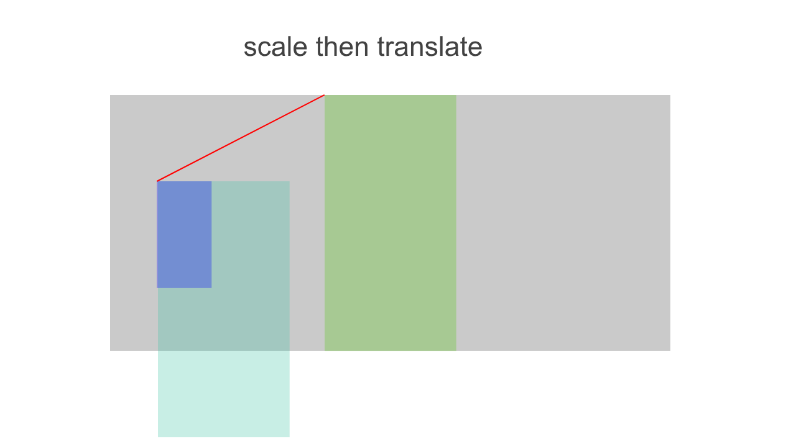

# Angular Dashboard

This project was generated using [Angular CLI](https://github.com/angular/angular-cli) version 20.0.1.

## Environment

- NodeJS: >= v22.0.0
- NPM: >= v9.0.0

## Development

To clone this project, run:

```bash
git clone https://github.com/chn-will-liu/AngularDashboard.git
```

To restore all the npm dependencies, run:

```bash
npm i
```

To start a local development server, run:

```bash
npm start
```

Once the server is running, open your browser and navigate to `http://localhost:4200/`. This also starts a `Json-server` simultaneously.

## Building

To build the project run:

```bash
npm run build
```

## Running unit tests

To execute unit tests with the [Karma](https://karma-runner.github.io) test runner, use the following command:

```bash
npm test
```

Or run chrome headless in case like CI/CD pipeline:

```bash
npm run test-ci
```

Open `/coverage/angular-dashboard/index.html` to see the code coverage.

## Scaling algorithm

### Steps

- Define `[x, y, w, h]` as a `bounding box`
- Get the `bounding box` of the lane using all the vertices including the interior path locations,

  - Calculate `xMin`, `xMax`, `yMin`, `yMax` of all the coordinates
  - Return `[xMin, yMin, xMax - xMin, yMax - yMin]` as the `bounding box` of the lane

- Set `[0, 0, 1920, 1080]` as the viewport bounding box

- Apply margin to the viewport box, set the content area as the `container box`

- Calculate the transform matrix for fitting the `lane bounding box` into the `container box`.

  - Calculate scale

    - Calculate `scaleX` and `scaleY`. If the aspect ratio of the lane bounding box is greater than the container's, use `scaleX`, otherwise use `scaleY` as the scale factor
    - Scaling will be applied with transform origin being set to the lane bounding box's `(left, top)` corner

  - Calculate `[tx, ty]` for `translate()` after scaling

    - Set `[laneBoundingBox.x, laneBoundingBox.y]` as the `origin` point
    - Set `diffX` as `containerBox.w - box.w * scale`, `diffY` as `containerBox.h - box.h * scale`. After scaling, either the width or height will be the same as the container box's. That said, either `diffX` or `diffY` will be 0.
    - Set `[containerBox.x + diffX / 2, containerBox.y + diffY / 2]` as the `dest` point
    - Return `[dest.x - origin.x, dest.y - origin.y]`

  - Transform maxtrix is `scale(s) translate(tx,ty)`

- Traverse every vertex and its interior path location, apply the transformation to every coordinates



Scaling with the box's `(0, 0)` point makes `translate` easier to understand.

### Edge cases

- All service points are on the same line, vertically or horizontally
- Only one vertex in the map or even empty (Probably won't be a real world case)

### Third party library

The npm package `transformation-matrix` is used to help with 2D points transformation. The two transform functions being used are `scale()` and `translate()`.

Why matrix? Because when it comes to coordinate transformation, it's all about linear algebra.

### Highlights

- Viewport margin configurable
- Viewport size configurable
- Edge cases covered (single vertical or horizonal lane)
- Using matrix for coordinates transformation

## Trade-off

### Scaling

Since the lane graphic is scaled to fit into the viewport, the lane width renders differently depending on the size of the entire lane graphic. This is okay, but the marker of vertices don't scale along with the lane.

This means sometimes the marker looks smaller comparing to the lane width, which may or may not make sense depending on the business requirement.

If the marker also needs to be scaled along with the entire lane graphic, we might have better and simpler solutions.

### HttpResource

For easy demonstration purpose, the experimental API `HttpResource` is used to handle signal-based http requests.

RxJS observable also does the work but to interoperate with signals it will take a bit of extra effect.
